# TakWolf's Game Engine (tge)

[](https://crates.io/crates/tge)

A lightweight cross-platform 2D game framework written in pure Rust and based on OpenGL 3.3+.

## Features

* 2D only and use pixel unit.
* Hardware-accelerated rendering base on OpenGL.
* Automatically process rendering batch.
* Dynamic font rendering with text layout.
* Support high-DPI.
* Keyboard, mouse, touch, touchpad and gamepad input handling.
* Audio play. (TODO)

## Non goals

* 3D.
* Visual editor.

The following does not contain, but can easily work with other crates:

* Entity Component System (ECS).
* Physics engines and collision detection.
* Network.

## Usage

Add the dependency line to your `Cargo.toml` file:

```toml
[dependencies]
tge = "0.0.4"
```

To release performance, also add the following configs:

```toml
[profile.dev]
opt-level = 3
```

Then create a basic template. Here is the minimal example that will create a window:

```rust
use tge::prelude::*;

struct App {}

impl App {
    fn new(_: &mut Engine) -> GameResult<Self> {
        // load assets
        Ok(Self {})
    }
}

impl Game for App {
    fn update(&mut self, _: &mut Engine) -> GameResult {
        // handle logic
        Ok(())
    }

    fn render(&mut self, engine: &mut Engine) -> GameResult {
        engine.graphics().clear(Color::BLUE);
        // draw sprites
        Ok(())
    }
}

fn main() -> GameResult {
    let mut engine = EngineBuilder::new()
        .window_config(WindowConfig::new()
            .title("My Game")
            .inner_size((1024.0, 600.0)))
        .build()?;
    let mut app = App::new(&mut engine)?;
    engine.run(&mut app)
}
```

That is!

You can also see the [`examples/`](examples/) directory to learn other examples.

## Examples

### [camera](examples/camera.rs)

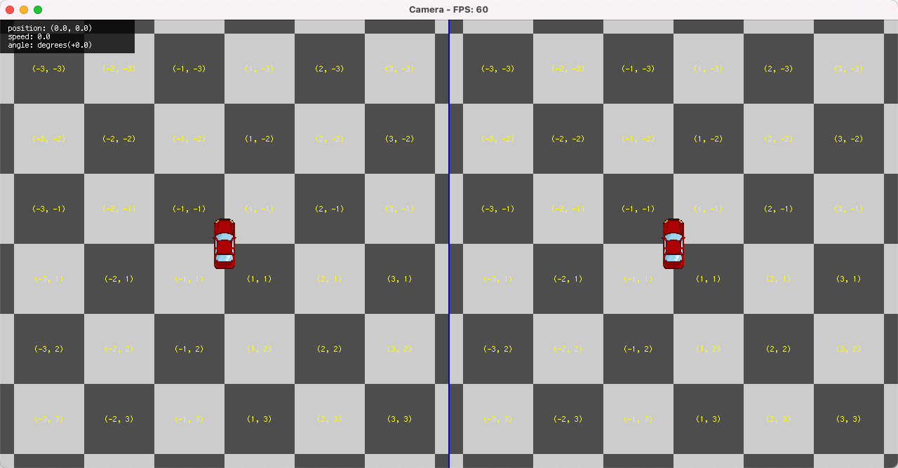

### [cannon](examples/cannon.rs)

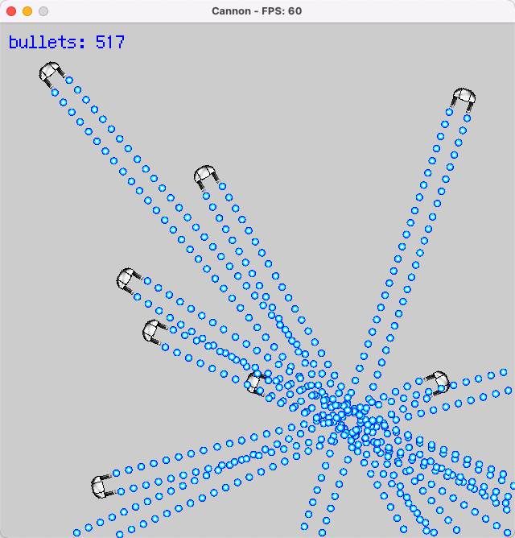

### [clock](examples/clock.rs)

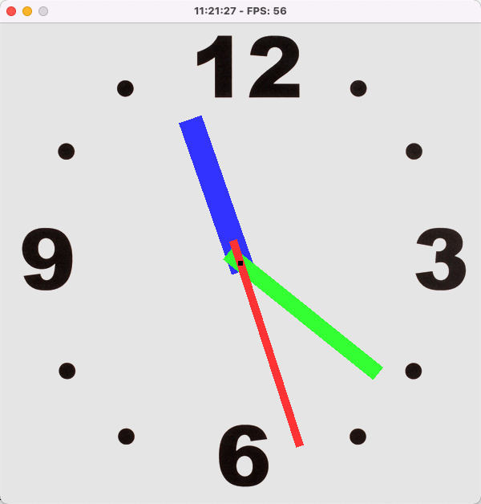

### [bunny_mark](examples/bunny_mark.rs)

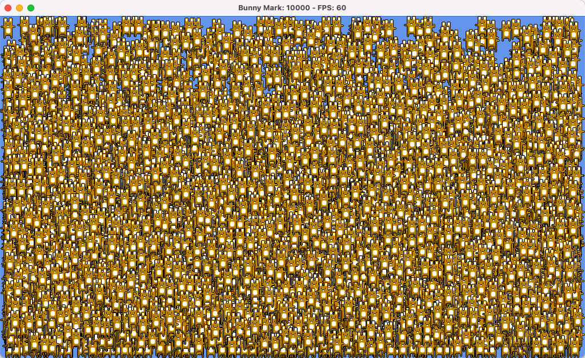

### [hare_mark](examples/hare_mark.rs)

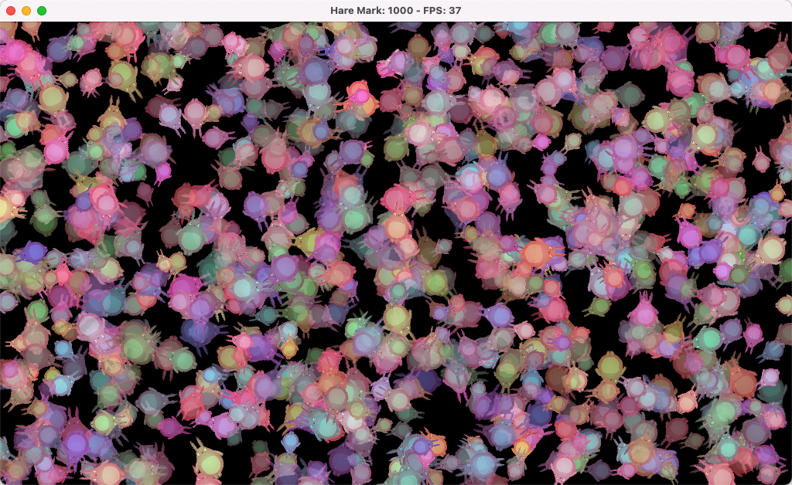

### [frame_animation](examples/frame_animation.rs)

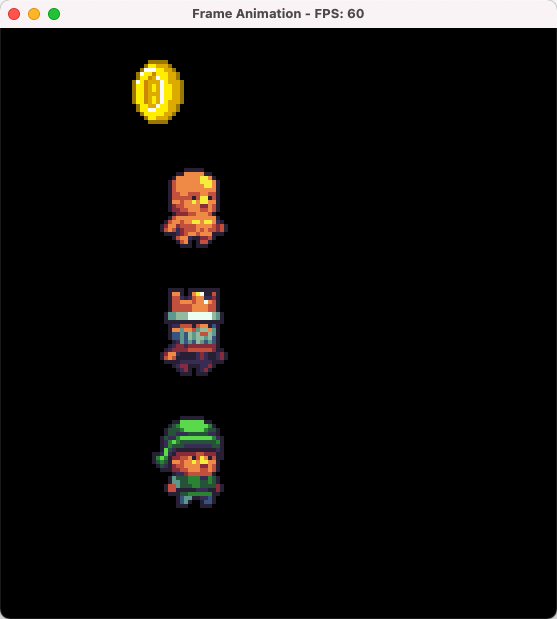

### [parallax_forest](examples/parallax_forest.rs)

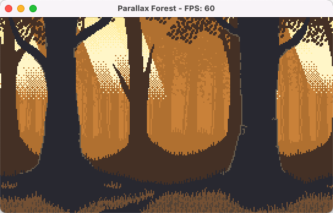

### [parallax_mountain](examples/parallax_mountain.rs)

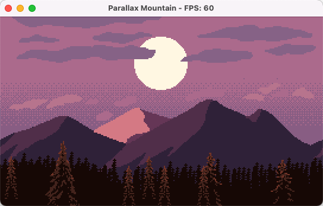

### [dvd](examples/dvd.rs)

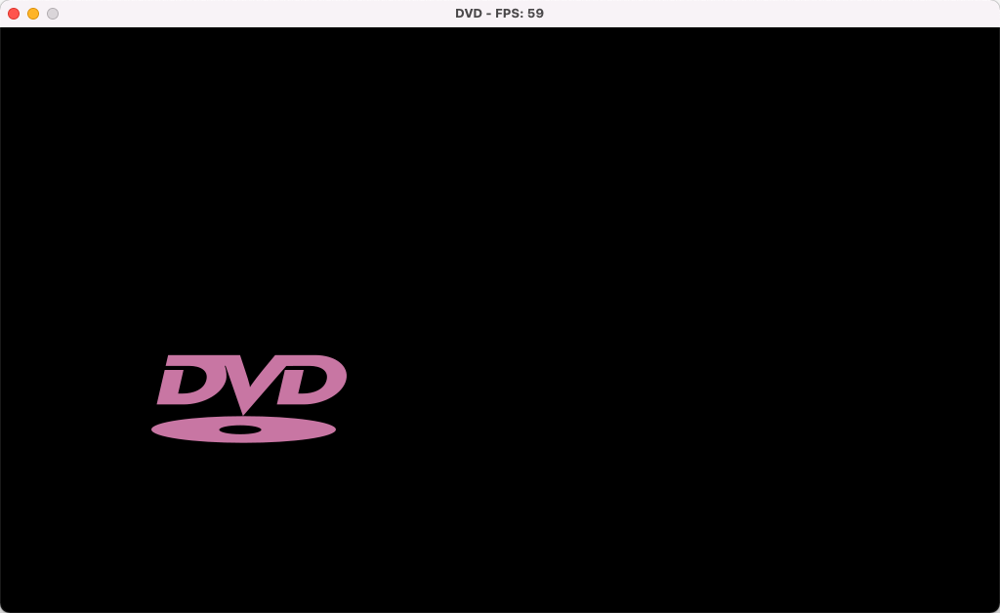

### [text_layout](examples/text_layout.rs)

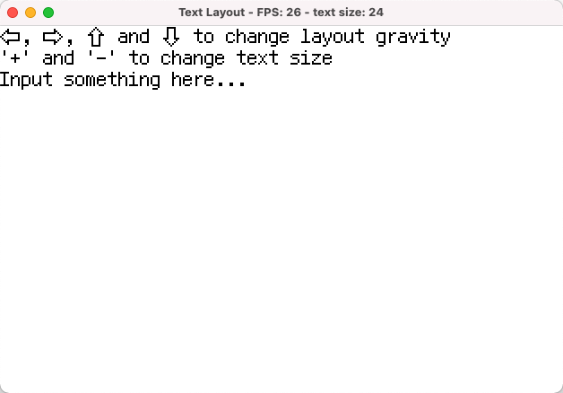

### [stroke_text](examples/stroke_text.rs)

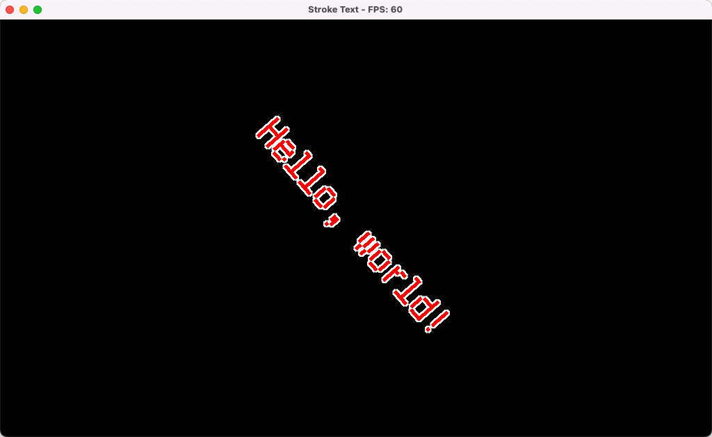

## License

[MIT License](LICENSE-MIT) OR [Apache License 2.0](LICENSE-APACHE)
